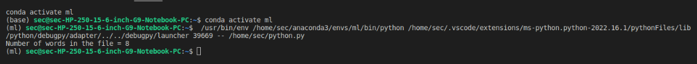

# Word-count
## AIM:
To write a python program for getting the word count from a text.
## EQUIPEMENT'S REQUIRED: 
Hardware:PC

Software:Anaconda - Python 3.7
## ALGORITHM: 
### Step 1:
create a new text file and add comment

### Step 2: 
create a python file and add program
### Step 3: 
Run the program 
### Step 4:  
Get the output 
### Step 5: 
Take the output as screenshot
### Step 6: 
End of the program
## PROGRAM:
```
num_words=0
with open("text.txt",'r') as f1:
    for i in f1:
        word=i.split()
        num_words+= len(word)
    print("Number of words in the file = {}".format(num_words)) 
```
### OUTPUT:



## RESULT:
Thus the program is written to find the word count from a text.
